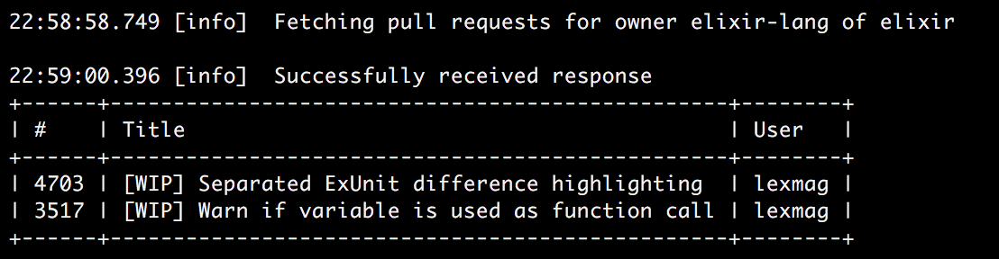

# Ara

**Getting the taste of elixir**



## Setup GitHub API Access Token and URL

In your _~/.profile_ or _~/.bash_profile_ add the [access token you have generated](https://github.com/settings/tokens) for your GitHub account. The access token doesn't need any rights other than the default public ones.

```bash
export ARA_GITHUB_API_ACCESS_TOKEN="xxx"
export ARA_GITHUB_API_BASE_URL="https://api.github.com"
```
Then update your environment variables by `source ~/.bash_profile`

## Run

`macbook:ara kim$ ./ara -pr q231950 ara` will load the pull requests of owner `q231950` and repository `ara` where the assignee equals the user whose access token is setup as `ARA_GITHUB_API_ACCESS_TOKEN`.
Depending on your repo it renders something like this if you're assigned to a pull requests of the given repo.

```
+---+------------------------------------+---------+
| # | Title                              | Author  |
+---+------------------------------------+---------+
| 4 | Adds a minor change to have a diff | q231950 |
+---+------------------------------------+---------+
```

## Installation

If [available in Hex](https://hex.pm/docs/publish), the package can be installed as:

  1. Add ara to your list of dependencies in `mix.exs`:

        def deps do
          [{:ara, "~> 0.0.1"}]
        end

  2. Ensure ara is started before your application:

        def application do
          [applications: [:ara]]
        end
